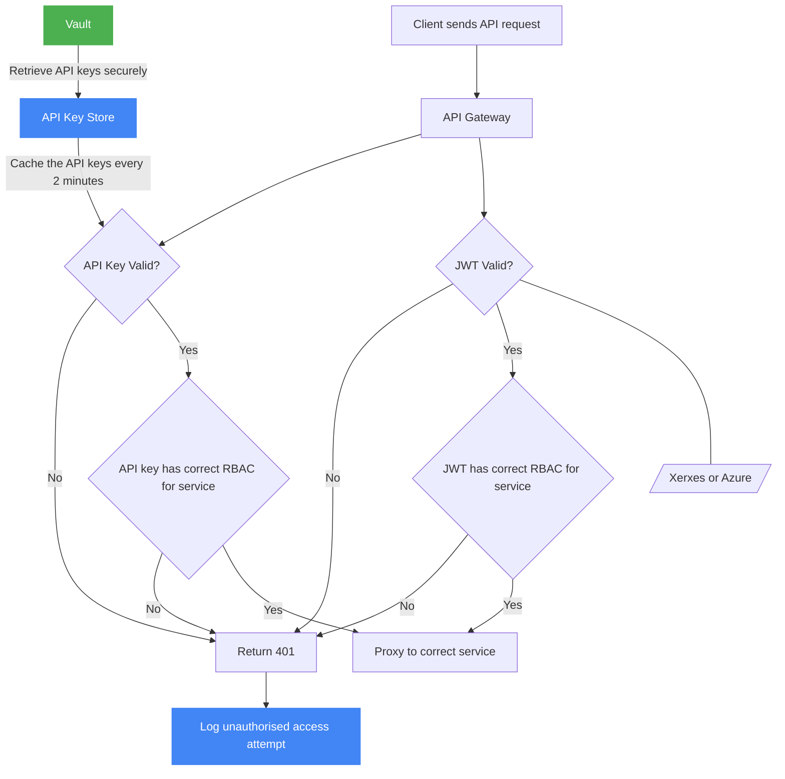

## Diagram of flow

```mermaid
flowchart TD
    Client["Client sends API request"] --> Gateway["API Gateway"]
    Vault["Vault"] -->|Retrieve API keys securely| Store["API Key Store"]
    Store["API Key Store"] -->|Cache the API keys every 2 minutes| KeyValid
    Gateway --> KeyValid{"API Key Valid?"}
    Gateway --> JWTValid{"JWT Valid?"}
    
    KeyValid -->|No| Return["Return 401"]
    KeyValid -->|Yes| RBAC{"API key has correct RBAC for service"}
    
    JWTValid -->|No| Return
    JWTValid -->|Yes| JWRBAC{"JWT has correct RBAC for service"}
    
    RBAC -->|No| Return
    JWRBAC -->|No| Return
    
    RBAC -->|Yes| Proxy["Proxy to correct service"]
    JWRBAC -->|Yes| Proxy
    
    Return --> Log["Log unauthorised access attempt"]
    
    %% Adding a note about JWT authentication
    JWTNote[/"Xerxes or Azure"/]
    JWTValid --- JWTNote
    
    %% Styling
    classDef vault fill:#4caf50,stroke:#4caf50,color:white
    classDef store fill:#4285f4,stroke:#4285f4,color:white
    classDef logNode fill:#4285f4,stroke:#4285f4,color:white
    class Vault vault
    class Store store
    class Log logNode
```
